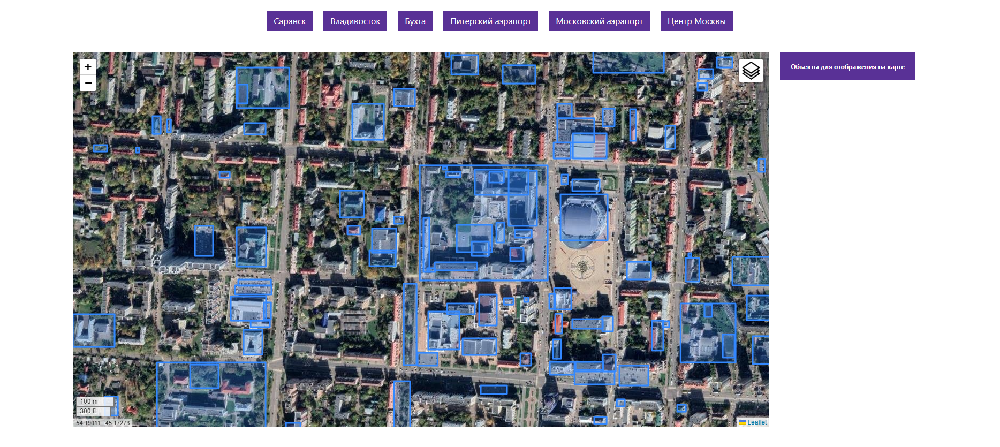

# 1. Описание

Данный репозиторий содеожит Web-интерфейс для [проекта](https://github.com/betepok506/aerial-photography-server). 

*Примечание: Проект находится в разработке, подробное описание будет позже*

# 2. Интерфейс
Интерфейс главной страницы карты с отображенными полигонами объектов



# 3. Запуск

## 3.1 Локальная установка зависимостей

Для локального запуска необходимо произвесту установку зависимостей, выполнив команду:
```commandline
pip install -r requirements.txt
```

# Дальнейшая работа:
- Улучшение интерфейса
- Добавление функционала вывода информации об объекте по клику
- Добавление возможности выбора объекта из списка
- Добавление разных карт/слоев
- Упаковка в Docker контейнер
- ...
